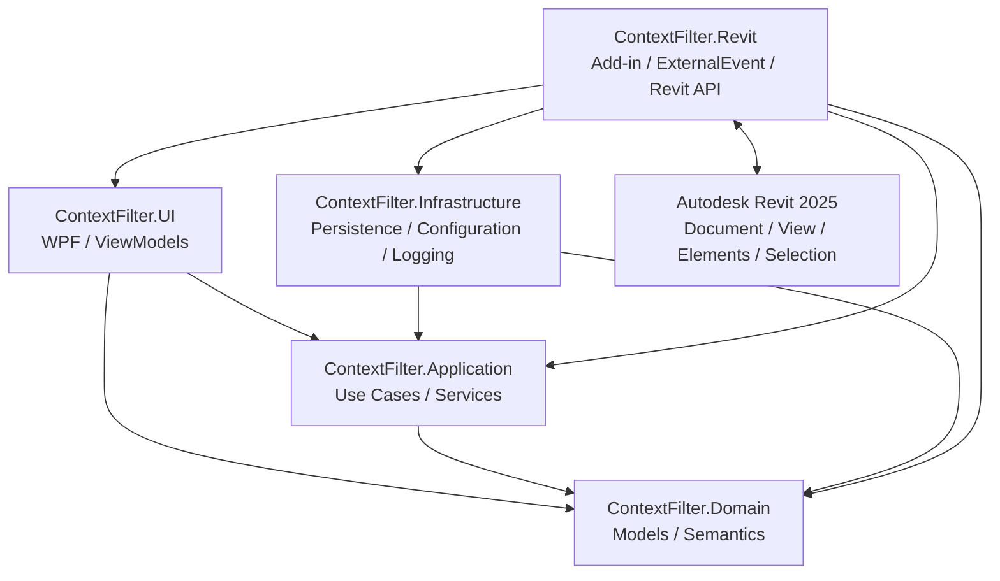

<p align="center">
  
</p>

<p align="center">
  <a href="README.md"><b>Русский</b></a> ·
  <a href="README_EN.md">English</a>
</p>

<p align="center">
  <strong>Реальный кейс системного анализа, проектирования, разработки и внедрения плагина контекстной фильтрации для Autodesk Revit 2025.</strong>
</p>

<p align="center">
  <code>Системный анализ</code>
  <code>Revit 2025</code>
  <code>Clean Architecture</code>
  <code>ExternalEvent</code>
  <code>WPF / MVVM</code>
  <code>SSAD</code>
</p>

<p align="center">
  <a href="https://t.me/sadblueses">
    
  </a>
  &nbsp;
  <a href="mailto:danrogulin@gmail.com">
    
  </a>
</p>

---

## Контекст проекта

**ContextFilter — это плагин для Autodesk Revit, который прошёл путь от запроса заказчика до разработки, пользовательского тестирования, приёмки и внедрения.**

| Вопрос | Контекст |
|---|---|
| **Источник задачи** | Заказчику требовался расширенный аналог существующих инструментов Bimstep / ModPlus для быстрой контекстной фильтрации элементов Revit. |
| **Моя роль** | **Системный аналитик · Проектировщик решения · Разработчик** |
| **Что было в моей ответственности** | Сбор и уточнение требований, системный анализ, проектирование решения, реализация, сопровождение пользовательского тестирования, стабилизация и внедрение. |
| **Заказчик** | Заместитель директора проектного института. |
| **Предметный эксперт** | BIM-координатор. |
| **Как проверялся анализ** | Аналитическая модель была доведена до работающего плагина; ограничения Revit, результаты пользовательского тестирования и фактическое поведение реализации возвращались обратно в системную модель. |
| **Приёмка** | Финальный результат принимал директор проектного института. |
| **Результат** | Плагин принят, внедрён и используется. После внедрения заказчиком не сообщалось об ошибках или претензиях. |
| **Что представляет этот репозиторий** | Публичная, обезличенная и ориентированная на читателя реконструкция системного анализа реализованного продукта; production-код плагина здесь не публикуется. |

```text
Запрос заказчика + BIM-экспертиза
              ↓
      Уточнение требований
              ↓
        Системный анализ
              ↓
      Проектирование решения
              ↓
           Разработка
              ↓
   Пользовательское тестирование
              ↓
 Корректировка поведения и границ
              ↓
        Приёмка директором
              ↓
           Внедрение
```

---

## Что такое ContextFilter?

**ContextFilter** помогает пользователю быстро перейти от текущей задачи в Revit к точному набору элементов и сразу выполнить действие над найденным результатом.

Пользователь выбирает рабочую область:

- активный вид;
- весь текущий документ;
- текущее / предварительное выделение.

Затем система позволяет сузить набор через:

```text
Категория
→ Семейство
→ Тип
→ Параметр
→ Значение
→ Логические условия
```

Над найденным набором можно выполнить предусмотренное действие:

- заменить, дополнить или сократить выделение;
- временно скрыть элементы;
- временно изолировать элементы;
- выполнить инверсионную изоляцию;
- сохранить и повторно использовать пресет или шаблон фильтра;
- при совместимости создать штатный фильтр Revit.

ContextFilter **не является редактором BIM-модели**: фильтрация не должна удалять, перемещать или произвольно изменять исходные элементы.

---

## Проблема

До ContextFilter похожая задача могла требовать ручной последовательности:

```text
Найти нужный вид / разрез / 3D
        ↓
Найти подходящий элемент
        ↓
Выбрать похожие экземпляры
        ↓
Проверить корректность выборки
        ↓
Скрыть / изолировать / продолжить работу
```

Исходное ТЗ отдельно фиксировало проблему неточного выбора: фильтрация по конкретному типу могла захватывать элементы других типов.

Поэтому задача была не просто в создании удобного интерфейса. Система должна была одновременно обеспечить:

```text
понятную область поиска
+
стабильную идентичность параметров
+
точную семантику фильтра
+
безопасное выполнение действий в Revit
+
приемлемую работу на реальных моделях
```

---

## Основной системный поток

```text
Текущий контекст Revit
        ↓
Сбор элементов
        ↓
ElementSnapshot / параметры
        ↓
Category → Family → Type
        ↓
FilterDefinition
        ↓
Вычисление фильтра в памяти
        ↓
FilterResult
        ↓
Расчёт целевого набора действия
        ↓
ExternalEvent / Revit API
        ↓
Выделение / видимость / штатный фильтр
```

Ключевое разделение:

```text
что пользователь хочет найти
!=
как система вычисляет результат
!=
что пользователь делает с результатом
!=
как Revit разрешает выполнить это действие
```

---

## Архитектура решения

Реализованное решение построено по принципам **Clean Architecture** и состоит из пяти проектов.



| Область | Каноническая ответственность |
|---|---|
| **Domain** | Смысл контекста, параметров, фильтра, пресетов и результата. |
| **Application** | Сценарии использования, координация, вычисление фильтра, расчёт целевых наборов и порты. |
| **Infrastructure** | Локальное хранение, миграции схем, проверка настроек и файловое журналирование. |
| **UI** | WPF-представление, ViewModels, пользовательские команды и состояние текущей сессии. |
| **Revit** | Точка входа плагина, `ExternalEvent`, сбор элементов, адаптация параметров, реальные действия, транзакции и жизненный цикл Revit. |

Важно: направление зависимостей к Domain **не означает**, что Domain владеет BIM-моделью. Источником истины для `Document`, `Element`, `View`, выделения и правил Revit API остаётся Autodesk Revit.

Подробное системное представление: [`system/`](system/).

---

## Ключевые системные решения

### 01 · Явная рабочая область

Фильтр не ищет элементы «вообще в модели». Он всегда работает внутри выбранной области:

```text
ActiveView
или EntireDocument
или CurrentSelection
        ↓
кандидаты для фильтрации
```

Один и тот же фильтр может давать разные результаты в разных областях — и это корректное поведение.

### 02 · Revit остаётся источником истины

```text
Revit Element
!=
ElementSnapshot
```

`ElementSnapshot` — производное представление для клиентской фильтрации. Оно помогает вычислять условия без постоянного обращения к Revit API, но не становится новой BIM-моделью.

### 03 · Отображаемое имя параметра не является его идентичностью

Фильтрация опирается на стабильный `ParameterKey`, а не только на подпись вроде «Марка».

```text
Отображаемое имя
!=
ParameterKey
```

Это позволяет различать параметры экземпляра, типа и вычисляемые свойства и не строить системную логику на потенциально неоднозначных названиях.

### 04 · Отсутствие, пустота и незагруженность — разные состояния

```text
Параметр отсутствует
!=
Параметр существует, но пуст
!=
Параметр ещё не загружен в частичный snapshot
```

Это особенно важно из-за ленивой загрузки параметров: техническая неполнота представления не должна превращаться в ложное `NotExists`.

### 05 · Смысл фильтра отделён от способа вычисления

`FilterDefinition` хранит смысл пользовательского фильтра. Application может вычислять его несколькими эквивалентными способами — через индекс, последовательный или параллельный проход.

```text
FilterDefinition
!=
способ вычисления
```

Оптимизация допустима только пока она сохраняет тот же логический результат.

### 06 · Семантический фильтр шире штатного фильтра Revit

ContextFilter поддерживает более богатую модель условий, чем может выразить `ParameterFilterElement`.

```text
Корректный FilterDefinition
!=
обязательно совместимый штатный фильтр Revit
```

Создание штатного фильтра — дополнительное действие над совместимым подмножеством, а не каноническая форма фильтра ContextFilter.

### 07 · Результат фильтра и действие над ним разделены

```text
FilterResult
!=
выделение
!=
скрытие / изоляция
!=
создание штатного фильтра
```

Один найденный набор может использоваться несколькими действиями. Ошибка выполнения действия в Revit не должна задним числом превращать корректный результат фильтрации в неправильный.

### 08 · Revit API пересекается через явную границу

WPF и асинхронный код не получают права обращаться к Revit API из произвольного потока.

```text
UI / Application
→ IRevitGateway
→ RevitRequestQueue
→ ExternalEvent
→ основной поток Revit
→ Revit API
```

`ExternalEvent` здесь — не бизнес-операция, а механизм безопасного выполнения внутри host-приложения.

### 09 · Жизненный цикл документа ограничивает актуальность состояния

Кэш, дерево, индексы, снимки и результаты фильтра действительны только относительно Revit-контекста, из которого они получены.

```text
смена / закрытие документа
→ старое состояние больше не текущее
→ остановить устаревшую работу
→ сбросить привязанное к документу состояние UI
→ при необходимости собрать новый контекст
```

### 10 · Сохранённая конфигурация не считается доверенной автоматически

Пользовательские настройки проходят:

```text
чтение
→ миграция
→ проверка / нормализация
→ рабочая конфигурация
```

Это правило появилось из реального дефекта: некорректные сохранённые значения уже приводили к ошибкам в пользовательском тестировании.

---

## Что изменила реальная проверка

Первая работающая реализация не считалась окончательной системной истиной. Пользовательское тестирование переоткрыло несколько предположений.

| Наблюдение | Системная корректировка |
|---|---|
| Некорректные сохранённые настройки могли приводить к ошибкам | Добавлены проверка и нормализация перед использованием. |
| Фоновые операции продолжались после закрытия документа | Работа привязана к жизненному циклу документа и пользовательской сессии. |
| UI сохранял данные предыдущего документа | Добавлен сброс состояния, привязанного к документу. |
| Горячие клавиши вмешивались в штатное взаимодействие Revit | Они стали включаемыми пользователем; конфликтующие жесты были ограничены. |
| Панель и обработчики создавали лишнюю активность без необходимости | Автооткрытие отключено, тяжёлая работа ограничена активной сессией, часть инициализации стала ленивой. |
| Сбой загрузки пресетов выглядел как обычное пустое состояние | Добавлено явное предупреждение пользователю. |
| Изоляция выполнялась вне требуемой транзакционной механики Revit | Граница выполнения действия была исправлена с учётом требований Revit API. |
| Завершение Revit задерживалось | Оптимизировано завершение работы и освобождение ресурсов. |

Общий цикл:

```text
Реализация
→ наблюдаемое поведение
→ переоткрытие предположения
→ корректировка модели и кода
→ повторная проверка
```

Подробно: [`system/evolution/`](system/evolution/).

---

## Реализация и техническая проверка

Аналитическая модель была доведена до работающего решения на:

<p>
  
  
  
  
  
  
  
</p>

Ключевые технические механизмы реализации:

- `.NET 8` / `C# 12` / Revit 2025;
- WPF + MVVM;
- Clean Architecture;
- `ExternalEvent + Queue` для безопасного доступа к Revit API;
- `FilteredElementCollector` для чтения рабочего контекста;
- лёгкие и лениво дополняемые `ElementSnapshot`;
- клиентское вычисление фильтров в памяти;
- 19 операторов фильтрации и вложенные AND / OR группы;
- несколько стратегий вычисления с сохранением одной семантики;
- локальные JSON-настройки, пресеты, история и миграции схем;
- xUnit-тесты Domain/Application/UI/Infrastructure;
- ручная проверка поведения, требующего живого Autodesk Revit.

CI не заменяет интеграционную проверку в живом Revit: host-specific поведение проверялось в реальной среде.

---

## Результат проекта

Подтверждённый итог:

```text
Реализация
→ пользовательское тестирование
→ стабилизация
→ финальная проверка
→ приёмка директором
→ внедрение
→ использование
```

Плагин был принят директором проектного института, внедрён и используется. После внедрения заказчиком **не сообщалось об ошибках или претензиях**.

Это не заменяется выдуманными метриками: в кейсе не заявляются неподтверждённые цифры пользователей, подразделений, SLA или бизнес-KPI.

---

## Архитектура документации

Репозиторий организован по методологии **[SSAD — System-Structured Analysis Documentation](https://github.com/branch-danya-dev/ssad-methodology)**.

> **Система определяет структуру знания.**

Сначала описываются задача и система целиком, затем знание хранится у реальных технических владельцев:

```text
business/
system/
domain/
application/
infrastructure/
ui/
revit/
```

| Область | Что здесь канонично |
|---|---|
| [`business/`](business/) | Продуктовый контекст, границы, требования, правила, пользовательские процессы и связь требований с проверкой. |
| [`system/`](system/) | Архитектура всей системы, сквозные потоки, владение данными, инварианты, развитие и модель проверки. |
| [`domain/`](domain/) | Контекст, `ElementSnapshot`, `ParameterKey`, язык фильтра, пресеты и результат. |
| [`application/`](application/) | Сценарии использования, построение представлений, вычисление фильтра, действия и порты. |
| [`infrastructure/`](infrastructure/) | Локальное хранение, настройки, миграции, безопасная запись и журналирование. |
| [`ui/`](ui/) | WPF/MVVM, модель экрана, пользовательская сессия, обратная связь и состояние интерфейса. |
| [`revit/`](revit/) | Интеграция с Revit API, `ExternalEvent`, сбор, параметры, действия, транзакции и жизненный цикл. |

---

## Рекомендуемые маршруты чтения

### Быстрый обзор системы

```text
README
  ↓
business/context/product-context.md
  ↓
system/architecture/component-model.md
  ↓
system/invariants/system-invariants.md
  ↓
system/review/verification-model.md
```

### Системный анализ и требования

```text
business/requirements/
→ business/traceability/
→ system/flows/
→ system/invariants/
→ system/evolution/
```

### Семантика фильтра

```text
domain/context/
→ domain/parameters/
→ domain/filtering/
→ application/filtering/
```

### Интеграция с Autodesk Revit

```text
system/architecture/
→ revit/external-event/
→ revit/collection/
→ revit/actions/
→ revit/transactions/
→ revit/lifecycle/
```

---

## Главные различия в одном месте

```text
Revit Element
!= ElementSnapshot

DisplayName
!= ParameterKey

Missing
!= Empty
!= Not Loaded

FilterDefinition
!= способ вычисления

FilterResult
!= действие
!= результат действия

Кэш
!= источник истины Revit

Сохранённый пресет
!= текущий результат фильтра

Корректный фильтр ContextFilter
!= обязательно совместимый штатный фильтр Revit

Корректное намерение действия
!= право выполнить его вне правил Revit API
```

---

## Граница публичного кейса

Этот репозиторий документирует **системный анализ и архитектуру реально реализованного продукта**.

Он намеренно не публикует:

- название организации заказчика;
- внутренние материалы проектного института;
- production-исходники плагина;
- неподтверждённые пользовательские или бизнес-метрики.

Цель репозитория — показать не объём документации, а прослеживаемую цепочку:

```text
Проблема
→ требования
→ системные границы
→ модель
→ архитектурные решения
→ реализация
→ проверка
→ внедрённое поведение
```