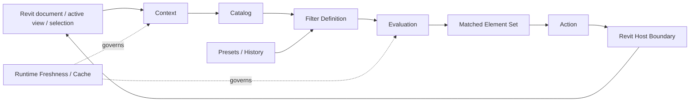

# ContextFilter — System Analysis

> **SSAD-based analysis of a real Autodesk Revit 2025 add-in for context-bounded BIM element filtering and actions.**

ContextFilter turns a large Revit model into an explicit working context, lets the user describe a filter over that context, evaluates the filter outside Revit API calls, and applies the resulting element set back to Revit through controlled actions.

<p>
  <a href="README.md"><strong>EN</strong></a> · <a href="README_RU.md">RU</a>
</p>

The repository is structured with **[SSAD — System-Structured Analysis Documentation](https://github.com/branch-danya-dev/ssad-methodology)** around system responsibilities rather than code layers such as Domain / Application / Infrastructure / UI.

---

## Project context

This is a **real completed automation project**, not a hypothetical training case. The original request was to build an extended analogue of existing Revit context-filtering tools, with broader filtering, selection and visibility workflows for a design institute.

| Question | Project context |
|---|---|
| **My role** | **System Analyst · Solution Designer · Developer.** I owned the complete delivery loop: requirement collection and clarification, system analysis, solution design, implementation, user-testing support, stabilization and deployment. |
| **Customer** | The request came from a **deputy director of a design institute**. The organization is intentionally anonymized in this public case. |
| **Domain expertise** | A **BIM coordinator** acted as the primary domain expert and helped clarify real Revit workflows and expected filter behavior. |
| **Requirements evolution** | Two initial requirement drafts belonged to the same overall product direction. Some details were clarified with the customer, while implementation and user testing exposed additional runtime, host-interaction and failure-handling requirements. |
| **Acceptance** | Final acceptance was performed by the **director of the institute**. |
| **Outcome** | The plugin was **accepted, deployed and put into use**. No errors or complaints were reported after deployment. The exact user population is not claimed because it was not tracked for this public case. |
| **What this repository represents** | A **sanitized, reader-oriented reconstruction of the system knowledge** accumulated through the real project. Raw customer documents, organization identity and internal delivery materials are not published. |

The delivery loop was:

```text
Customer request + BIM domain expertise
                ↓
        Requirement clarification
                ↓
          System analysis
                ↓
          Solution design
                ↓
          Implementation
                ↓
           User testing
                ↓
  Runtime / host behavior corrections
                ↓
        Director acceptance
                ↓
             Deployment
```

The initial need was practical: users had to manually locate representative elements in Revit and then use native commands such as “Select All Instances” to find similar objects. The requested plugin was intended to make selection, hiding and isolation by category, family, type and parameters fast and contextual.

The requirements later expanded toward current-selection filtering, dynamic highlighting, reusable presets/templates, richer condition semantics and inverse actions. The implemented system additionally contains explicit scope handling, persistent history, native Revit filter creation and runtime strategies for large contexts.

See [`evidence/requirements-evolution.md`](evidence/requirements-evolution.md) for the requirement and stabilization history.

---

## System in one flow



Core model:

```text
SOURCE CONTEXT
      ↓
DERIVED CATALOG
      ↓
FILTER INTENT
      ↓
DERIVED RESULT SET
      ↓
EXPLICIT ACTION
      ↓
REVIT
```

---

## Core invariants

1. **Revit owns source model truth.** Context snapshots and filter results are derived knowledge.
2. **Context is explicit.** Active view, entire document and current selection are different scopes and must not be silently mixed.
3. **Filter meaning is independent from Revit API mechanics.** A valid semantic filter may be impossible to convert into a native `ParameterFilterElement`.
4. **Filtering does not modify model element content.** Selection and temporary visibility change interaction state; native filter creation changes annotation/view configuration, not the filtered elements themselves.
5. **Parameter identity is not just display text.** Instance, type, built-in/shared/project and synthetic parameters require stable identity semantics.
6. **Missing value != empty value.** The filter model keeps these cases distinct.
7. **Cached context is trusted only while fresh.** View, selection and document changes can invalidate derived knowledge.
8. **Revit API access crosses one controlled host boundary.** UI-side asynchronous work cannot directly treat the Revit API as thread-safe.

---

## Responsibility structure

```text
system/
├─ cross-system invariants, end-to-end behavior and synthesis
│
interaction/
├─ launch modes, filter session workflow and action availability
│
context/
├─ collection scope, candidate set and freshness
│
catalog/
├─ Category → Family → Type projection, parameter identity and values
│
filtering/
├─ filter definition, operators, logical composition and evaluation
│
actions/
├─ selection, temporary visibility and native Revit filter semantics
│
presets/
├─ reusable filter intent, templates, history and persistence ownership
│
runtime/
├─ cache invalidation, chunking, request coalescing and responsiveness
│
revit-boundary/
├─ Revit authority, ExternalEvent access and native realization
│
evidence/
└─ requirements evolution and implementation traceability
```

The structure follows the responsibilities of ContextFilter itself. It intentionally does **not** mirror the implementation solution folders.

---

## What each area answers

| Area | Canonical question |
|---|---|
| [`system/`](system/) | Do the local models form one coherent filtering system? |
| [`interaction/`](interaction/) | How does the user establish intent and trigger system behavior? |
| [`context/`](context/) | Which Revit elements belong to this filtering session, and is that context still fresh? |
| [`catalog/`](catalog/) | How are elements exposed as categories, families, types, parameters and values? |
| [`filtering/`](filtering/) | What exactly does the filter mean, and which elements satisfy it? |
| [`actions/`](actions/) | What may happen to the matched set? |
| [`presets/`](presets/) | Which reusable user intent persists across sessions? |
| [`runtime/`](runtime/) | How does the system remain responsive without trusting stale derived data? |
| [`revit-boundary/`](revit-boundary/) | What is Revit authoritative for, and how may the plugin safely cross that boundary? |
| [`evidence/`](evidence/) | Which claims came from requirements, implementation or later synthesis? |

---

## Key analytical distinctions

```text
Revit element
!= ElementSnapshot

Parameter display name
!= parameter identity

missing parameter
!= empty parameter value

semantic filter
!= native Revit filter

filter result
!= action on result

cache hit
!= source authority

physical in-process add-in
!= absence of ownership boundaries
```

These distinctions are the backbone of the case.

---

## Current implementation context

`Autodesk Revit 2025` · `C# / .NET 8` · `WPF` · `Revit API` · `ExternalEvent` · local JSON persistence

The implementation evidence also describes in-memory snapshots, multi-strategy filter evaluation, cache invalidation, chunked collection for larger contexts, persistent presets/history and native Revit filter conversion where the current semantic filter is compatible.

---

## Evidence model

The original requirement documents are treated as **evidence**, not as the current repository architecture.

```text
Customer requirements
        ↓
implemented behavior
        ↓
implementation evidence
        ↓
SSAD synthesis
        ↓
current canonical system model
```

Start with [`evidence/requirements-evolution.md`](evidence/requirements-evolution.md) to see how the requested behavior evolved before and during implementation.

---

## Methodology

**[SSAD — System-Structured Analysis Documentation](https://github.com/branch-danya-dev/ssad-methodology)**

> **The system determines the knowledge structure. Document types and code layers do not.**
