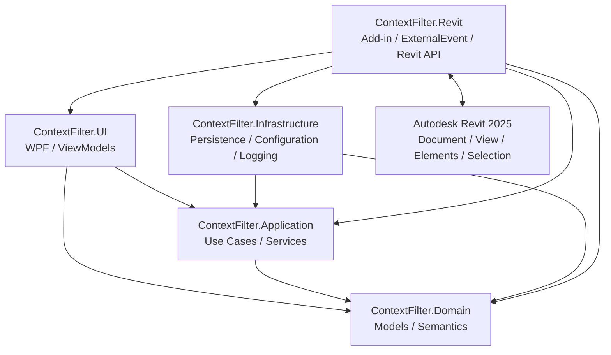

<p align="center">
  
</p>

<p align="center">
  <a href="README.md">Русский</a> ·
  <a href="README_EN.md"><b>English</b></a>
</p>

<p align="center">
  <strong>A real system-analysis, solution-design, implementation and deployment case for an Autodesk Revit 2025 contextual filtering add-in.</strong>
</p>

<p align="center">
  <code>System Analysis</code>
  <code>Revit 2025</code>
  <code>Clean Architecture</code>
  <code>ExternalEvent</code>
  <code>WPF / MVVM</code>
  <code>SSAD</code>
</p>

<p align="center">
  <a href="https://t.me/sadblueses">
    
  </a>
  &nbsp;
  <a href="mailto:danrogulin@gmail.com">
    
  </a>
</p>

---

## Project Context

**ContextFilter is an Autodesk Revit add-in that moved from a customer request through analysis, solution design, implementation, user testing, acceptance and deployment.**

| Question | Context |
|---|---|
| **Origin** | The customer needed an extended Bimstep / ModPlus-style tool for fast contextual filtering of Revit elements. |
| **My role** | **System Analyst · Solution Designer · Developer** |
| **What I owned** | Requirement collection and clarification, system analysis, solution design, implementation, user-testing support, stabilization and deployment. |
| **Customer** | Deputy director of a design institute. |
| **Domain expert** | BIM coordinator. |
| **How analysis was validated** | The analytical model was carried into a working add-in; Revit constraints, user-testing findings and implementation behavior fed back into the system model. |
| **Acceptance** | Final result accepted by the institute director. |
| **Outcome** | Accepted, deployed and in use. No errors or complaints were reported by the customer after deployment. |
| **What this repository is** | A public, anonymized, reader-oriented reconstruction of the implemented system analysis; production source code is not published here. |

```text
Customer request + BIM expertise
              ↓
      Requirement clarification
              ↓
          System analysis
              ↓
          Solution design
              ↓
          Implementation
              ↓
           User testing
              ↓
 Behavior / boundary corrections
              ↓
       Director acceptance
              ↓
            Deployment
```

---

## What is ContextFilter?

**ContextFilter** helps a Revit user move quickly from the current task to a precise element set and immediately perform a useful action on that result.

The user chooses a working context:

- active view;
- entire current document;
- current / preselected element set.

Then the set can be narrowed through:

```text
Category
→ Family
→ Type
→ Parameter
→ Value
→ Logical conditions
```

The matched set can then be used to:

- replace, extend or reduce the Revit selection;
- temporarily hide elements;
- temporarily isolate elements;
- perform inverse isolation;
- save and reuse a full preset or template;
- create a native Revit filter when the semantic filter is compatible.

ContextFilter **is not a BIM model editor**: filtering must not arbitrarily delete, move or modify source model elements.

---

## The Problem

Before ContextFilter, a similar workflow could require a manual sequence:

```text
Find an appropriate view / section / 3D
        ↓
Find the target element
        ↓
Select similar instances
        ↓
Verify the selected set
        ↓
Hide / isolate / continue work
```

The original requirement explicitly recorded inaccurate type filtering where elements of other types could be included.

So the task was not only to build a convenient UI. The system also had to provide:

```text
an explicit search universe
+
stable parameter identity
+
precise filter semantics
+
safe Revit-side execution
+
acceptable behavior on real models
```

---

## Core System Flow

```text
Current Revit context
        ↓
Collect elements
        ↓
ElementSnapshot / parameters
        ↓
Category → Family → Type
        ↓
FilterDefinition
        ↓
In-memory evaluation
        ↓
FilterResult
        ↓
Calculate action target set
        ↓
ExternalEvent / Revit API
        ↓
Selection / visibility / native filter
```

The key separation is:

```text
what the user wants to find
!=
how the result is evaluated
!=
what the user does with the result
!=
how Revit permits that action to be executed
```

---

## Implemented Architecture

The delivered solution follows **Clean Architecture** and contains five projects.



| Area | Canonical responsibility |
|---|---|
| **Domain** | Meaning of context, parameters, filters, presets and results. |
| **Application** | Use cases, orchestration, filter evaluation, target-set calculations and ports. |
| **Infrastructure** | Local persistence, schema migrations, settings validation and file logging. |
| **UI** | WPF presentation, ViewModels, user commands and current-session state. |
| **Revit** | Add-in entry point, `ExternalEvent`, collection, parameter adaptation, actual host actions, transactions and Revit lifecycle. |

Dependency direction toward Domain **does not mean** Domain owns the BIM model. Autodesk Revit remains the authority for `Document`, `Element`, `View`, selection and Revit API execution rules.

Full system view: [`system/`](system/).

---

## Core System Decisions

### 01 · Explicit working context

The filter never searches an undefined global universe. It always works inside one selected context:

```text
ActiveView
or EntireDocument
or CurrentSelection
        ↓
candidates for filtering
```

The same filter can legitimately produce different results in different contexts.

### 02 · Revit remains the source authority

```text
Revit Element
!=
ElementSnapshot
```

`ElementSnapshot` is a derived representation used for client-side filtering. It reduces repeated Revit API access but never becomes a replacement BIM model.

### 03 · Display name is not parameter identity

Filtering relies on stable `ParameterKey` identity rather than only a label such as “Mark”.

```text
Display name
!=
ParameterKey
```

This allows instance, type and synthetic properties to remain distinguishable even when readable labels are ambiguous.

### 04 · Missing, empty and not loaded are different states

```text
Parameter is missing
!=
Parameter exists but is empty
!=
Parameter has not yet been loaded into a partial snapshot
```

This distinction matters because parameter data are loaded lazily: a technical absence in the current in-memory representation must not become a false `NotExists` conclusion.

### 05 · Filter meaning is independent from evaluation strategy

`FilterDefinition` owns the semantic meaning of a user filter. Application can evaluate it through equivalent indexed, sequential or parallel strategies.

```text
FilterDefinition
!=
evaluation strategy
```

Optimization is valid only while the logical result remains equivalent.

### 06 · Semantic filter is richer than native Revit filter representation

ContextFilter supports conditions that cannot always be represented by `ParameterFilterElement`.

```text
valid FilterDefinition
!=
necessarily native-Revit-compatible filter
```

Native filter creation is an optional action for the compatible subset, not the canonical form of a ContextFilter filter.

### 07 · Filter result and action result are separate

```text
FilterResult
!=
selection
!=
hide / isolate
!=
native filter creation
```

The same matched set can feed different actions. A Revit-side action failure must not retroactively redefine a correct filter result.

### 08 · Revit API is crossed through an explicit host boundary

WPF and asynchronous code do not gain permission to call Revit API from arbitrary threads.

```text
UI / Application
→ IRevitGateway
→ RevitRequestQueue
→ ExternalEvent
→ Revit main thread
→ Revit API
```

`ExternalEvent` is a safe host-execution mechanism, not a business operation.

### 09 · Document lifecycle bounds state freshness

Caches, trees, indexes, snapshots and filter results are only valid relative to the Revit context that produced them.

```text
document close / switch
→ old derived state is no longer current
→ stop obsolete work
→ reset document-bound UI state
→ recollect when needed
```

### 10 · Persisted configuration is not trusted automatically

User settings pass through:

```text
load
→ migrate
→ validate / normalize
→ runtime configuration
```

This rule came from an observed defect: invalid persisted settings had already caused failures during user testing.

---

## What Real Testing Changed

The first working implementation was not treated as final system truth. User testing reopened several assumptions.

| Observation | System correction |
|---|---|
| Invalid persisted settings could cause failures | Added validation and normalization before use. |
| Background work continued after a document was closed | Bound work to document and user-session lifecycle. |
| UI state survived document transitions | Added reset for document-bound presentation state. |
| Hotkeys interfered with native Revit interaction | Made them opt-in and constrained conflicting gestures. |
| Pane/event activity created unnecessary background work | Disabled auto-open, gated heavy work by active session and moved selected initialization to lazy execution. |
| Preset load failure looked like a valid empty state | Added explicit user warning. |
| Isolation ran outside required Revit transaction mechanics | Corrected the action execution boundary to respect Revit API rules. |
| Revit shutdown was delayed | Optimized teardown and resource release. |

General feedback loop:

```text
Implementation
→ observed behavior
→ reopened assumption
→ model + code correction
→ verification again
```

Details: [`system/evolution/`](system/evolution/).

---

## Implementation and Technical Verification

The analytical model was carried into a working implementation based on:

<p>
  
  
  
  
  
  
  
</p>

Key implementation mechanisms include:

- `.NET 8` / `C# 12` / Revit 2025;
- WPF + MVVM;
- Clean Architecture;
- `ExternalEvent + Queue` for safe Revit API access;
- `FilteredElementCollector` for working-context collection;
- light and lazily enriched `ElementSnapshot` models;
- client-side in-memory filter evaluation;
- 19 filter operators and nested AND / OR groups;
- multiple evaluation strategies preserving the same semantics;
- local JSON settings, presets, history and schema migrations;
- xUnit tests across Domain/Application/UI/Infrastructure;
- manual verification for behavior requiring a live Autodesk Revit host.

CI does not replace live-Revit integration verification: host-specific behavior was validated in the actual environment.

---

## Project Outcome

Confirmed result:

```text
Implementation
→ user testing
→ stabilization
→ final verification
→ director acceptance
→ deployment
→ use
```

The add-in was accepted by the institute director, deployed and is in use. **No errors or complaints were reported by the customer after deployment.**

The case does not replace missing evidence with invented metrics: no unsupported user-count, department-count, SLA or business-KPI claims are made.

---

## Documentation Architecture

This repository is organized using **[SSAD — System-Structured Analysis Documentation](https://github.com/branch-danya-dev/ssad-methodology)**.

> **The system determines the structure of knowledge.**

Business and whole-system knowledge come first; local technical knowledge is then owned by the real system areas:

```text
business/
system/
domain/
application/
infrastructure/
ui/
revit/
```

| Area | Canonical knowledge |
|---|---|
| [`business/`](business/) | Product context, scope, requirements, rules, user processes and traceability to validation. |
| [`system/`](system/) | Whole-system architecture, cross-layer flows, data ownership, invariants, evolution and verification. |
| [`domain/`](domain/) | Context, `ElementSnapshot`, `ParameterKey`, filter language, presets and results. |
| [`application/`](application/) | Use cases, derived projections, filter evaluation, actions and ports. |
| [`infrastructure/`](infrastructure/) | Local persistence, settings, migrations, safe writes and logging. |
| [`ui/`](ui/) | WPF/MVVM, screen model, user session, feedback and UI state. |
| [`revit/`](revit/) | Revit API integration, `ExternalEvent`, collection, parameters, actions, transactions and lifecycle. |

---

## Recommended Reading Paths

### Fast system review

```text
README
  ↓
business/context/product-context.md
  ↓
system/architecture/component-model.md
  ↓
system/invariants/system-invariants.md
  ↓
system/review/verification-model.md
```

### System analysis and requirements

```text
business/requirements/
→ business/traceability/
→ system/flows/
→ system/invariants/
→ system/evolution/
```

### Filter semantics

```text
domain/context/
→ domain/parameters/
→ domain/filtering/
→ application/filtering/
```

### Autodesk Revit integration

```text
system/architecture/
→ revit/external-event/
→ revit/collection/
→ revit/actions/
→ revit/transactions/
→ revit/lifecycle/
```

---

## Key Distinctions at a Glance

```text
Revit Element
!= ElementSnapshot

DisplayName
!= ParameterKey

Missing
!= Empty
!= Not Loaded

FilterDefinition
!= evaluation strategy

FilterResult
!= action
!= action outcome

Cache
!= Revit source authority

Persisted preset
!= current FilterResult

Valid ContextFilter filter
!= necessarily native-Revit-compatible filter

Valid action intent
!= permission to execute outside Revit API rules
```

---

## Public Case Boundary

This repository documents the **system analysis and architecture of a real implemented product**.

It intentionally does not publish:

- the customer organization's identity;
- internal design-institute materials;
- production source code;
- unsupported user or business metrics.

The purpose is to show a traceable chain rather than the raw volume of documentation:

```text
Problem
→ requirements
→ system boundaries
→ model
→ architecture decisions
→ implementation
→ verification
→ deployed behavior
```