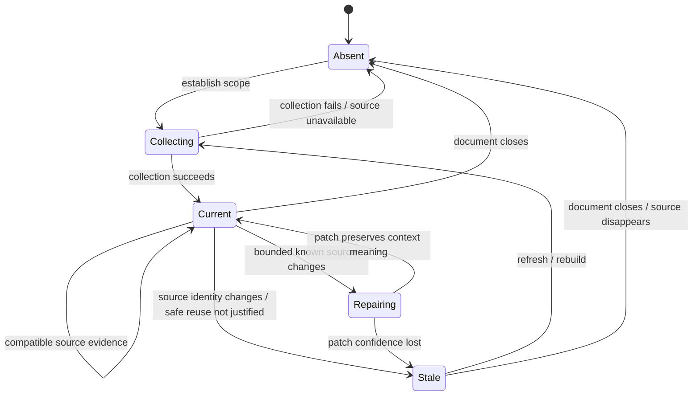

# Freshness and Lifecycle

## What this document describes

This document defines **when a derived ContextFilter context may still be treated as current and what must happen when Revit source state changes**.

It intentionally does not own:

- debounce values;
- chunk sizes;
- performance thresholds;
- concrete event-handler classes;
- UI rendering details.

Those belong to implementation/runtime mechanics. The canonical knowledge here is the lifecycle of context validity.

## Problem

ContextFilter deliberately evaluates filters over derived in-memory knowledge rather than re-reading the Revit model for every user interaction.

That makes responsiveness possible, but creates a correctness obligation:

> **Previously correct context can become stale while the plugin is still open.**

Freshness is therefore not an optimization concern. It is part of system correctness.

## Lifecycle model



The implementation does not need to expose these exact enum names. They describe the semantic states of trust.

## Absent

There is no candidate context that downstream analysis may use as current.

Examples include:

- no usable Revit document;
- the relevant document has been closed;
- previous context was discarded during document switch;
- collection failed before a valid context was established.

Important distinction:

```text
Absent context
!= valid context containing zero elements
```

## Collecting

The plugin is deriving a candidate context from Revit.

For larger scopes, implementation may perform this progressively rather than in one blocking operation.

During collection, downstream knowledge must not pretend that a partial candidate set is the final semantic context unless the system explicitly models partial results as such. The supplied implementation evidence does not establish partial filtering as canonical behavior, so the completed context remains the trust boundary.

## Current

A Context is current when:

```text
source identity is compatible
+ scope identity is compatible
+ freshness evidence remains valid
```

Only this state supports normal reuse by downstream Catalog and Filtering responsibilities.

## Repairing

Implementation evidence shows that smaller known `DocumentChanged` events may be handled through incremental patching rather than full recollection.

Semantically, patching is allowed only if the system can preserve the same context claim.

```text
known bounded changes
→ update affected derived records
→ context meaning remains equivalent to fresh recollection
→ return to Current
```

The exact numeric boundary for "small enough" is runtime policy, not Context semantics.

If repair cannot preserve confidence:

```text
patch uncertainty
→ Stale
→ rebuild before trusted reuse
```

## Stale

A stale context is derived knowledge whose previous provenance no longer justifies treating it as current.

Typical triggers include:

- relevant model changes that cannot be safely patched;
- active-view change for `ActiveView` scope;
- selection change for `CurrentSelection` scope;
- document switch;
- any source-identity mismatch detected by the implementation.

Stale is not the same as incorrect data in every field. It means the system no longer has enough authority to claim that the old derivation describes the current source universe.

## Event-to-context rules

### Document change

Implementation evidence uses debounced `DocumentChanged` processing and chooses between incremental patching and broader invalidation.

Canonical rule:

```text
source model changes
→ reopen context freshness
→ patch only if equivalence can be preserved
→ otherwise invalidate
```

### Active view change

For `ActiveView`:

```text
active view changes
→ old candidate universe is no longer the current ActiveView universe
→ recollect before trusted use
```

For `EntireDocument`, a view change does not by itself redefine the selected scope, though host/session behavior may still cause other refresh work.

### Selection change

For `CurrentSelection`:

```text
selection changes
→ selection-bound identity changes
→ old CurrentSelection context invalid
```

Implementation evidence explicitly invalidates `CurrentSelection` on selection change.

For other scopes, selection change is not by itself a semantic scope change.

### Document close or switch

User testing exposed a real lifecycle defect: background operations could continue after document close and UI state could survive document changes.

The corrected invariant is:

```text
document closes / switches
→ stop obsolete document-bound work
→ invalidate document-bound context
→ reset document-specific UI state
```

No candidate context may survive merely because an in-memory object still exists.

## Session activity

Implementation stabilization also established that heavy context work is session-bound.

```text
no active filter session / panel closed
→ no heavy collect / index / highlight work
```

This is primarily a runtime rule, but it affects Context lifecycle because collection and refresh are not intended to run indefinitely in the background after the user has stopped using the plugin.

The Context owner therefore depends on Runtime for execution policy while retaining the semantic rule that obsolete background work must not resurrect or maintain stale source claims.

## Cache trust

```text
cache available
!= context current
```

A cache entry is reusable only if its identity/freshness conditions still match the current source situation.

A useful conceptual decision is:

```text
cache lookup
    ↓
identity compatible?
    ├─ no → rebuild
    └─ yes
        ↓
source freshness compatible?
        ├─ no → patch or rebuild
        └─ yes → reuse
```

## Freshness propagation

When Context becomes stale, dependent derived knowledge must be reopened as well.

```text
Context stale
    ↓
Catalog derived from Context becomes stale
    ↓
Filter result over that candidate universe becomes stale
```

This does not necessarily mean presets become stale. A preset stores reusable filter intent, not the current candidate universe.

Therefore:

```text
source context invalidation
!= preset invalidation
```

This distinction prevents broad, unnecessary invalidation across unrelated ownership areas.

## Failure behavior

The system should not collapse freshness failures into an empty result.

```text
context unavailable / stale / collection failed
!= filter evaluated successfully and found 0 elements
```

If current context cannot be trusted, interaction should expose that the source context requires refresh or could not be established rather than showing an apparently valid zero-match state.

## Typical errors

- treating a cache hit as proof of freshness;
- keeping selection-bound context after selection changes;
- carrying document-bound UI/context into a new document;
- continuing background work after the source document has disappeared;
- patching an uncertain change only to avoid recollection;
- invalidating persisted filter intent merely because source context changed;
- presenting stale/unavailable context as a valid empty candidate set.

## Check

Freshness behavior is coherent if every downstream filter result can answer:

> **Which source context was used, what changes have occurred since it was derived, and why was reuse still safe at the moment of evaluation?**
