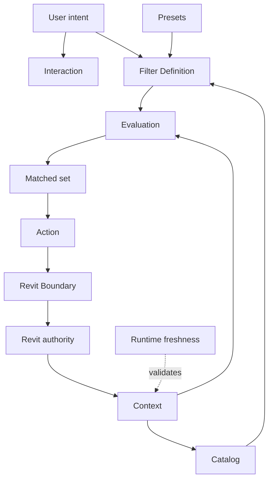

# ContextFilter — System Synthesis

This area owns **cross-system behavior that cannot be answered correctly by one local responsibility alone**.

## Canonical question

> Do context acquisition, catalog projection, filter semantics, actions, persistence and Revit realization form one coherent system?

## System equation

```text
FreshContext
+
FilterDefinition
→ Evaluate
→ FilterResult

FilterResult
+
ExplicitAction
→ Revit-side effect
```

The two stages must not be collapsed. Finding elements and deciding what to do with them are different responsibilities.

## Cross-system invariants

- Revit remains authoritative for document, view and element existence.
- A context snapshot is derived and has a freshness boundary.
- A filter definition is user intent owned by the plugin, not model truth.
- A filter result is derived from one explicit context plus one filter definition.
- An action may only operate on the current result or another explicitly supplied set.
- Selection / temporary visibility actions do not modify source element properties or geometry.
- Native Revit filter creation is a realization option, not the definition of filter semantics.
- Stored presets reproduce intent; they do not freeze Revit data values as authoritative facts.
- Implementation optimizations may change evaluation strategy but must not change logical result semantics.

## End-to-end flow



## Does not own

Local rules stay with their responsibility owner:

- scope/freshness → [`../context/`](../context/);
- parameter/category projection → [`../catalog/`](../catalog/);
- condition semantics → [`../filtering/`](../filtering/);
- action semantics → [`../actions/`](../actions/);
- Revit mechanics → [`../revit-boundary/`](../revit-boundary/).
